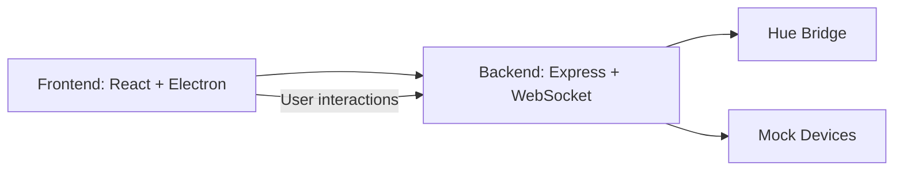

# HomeControl

**Desktop home automation platform with Philips Hue integration and mock device fallback.**

HomeControl lets you manage smart home devices (Hue, Nanoleaf) and scenes from a React dashboard or Electron desktop app. Supports real-time updates via REST API and WebSockets, with graceful fallback to mock devices if the Hue Bridge is unavailable.

---

## Features

- Real-time device control & scenes
- Philips Hue Bridge integration + mock fallback
- Modular device handler architecture
- React dashboard + Electron desktop app
- JSON persistence for devices & scenes

---

## Quick Start

### Install Dependencies
```bash
# Backend
npm install

# Frontend
cd client && npm install && cd ..
```

### Run the System
```bash
# Backend server
npm start

# Frontend (React dashboard)
cd client && npm run dev

# Electron desktop app
npm run electron
```

> For full development with hot-reload and Electron, run `npm run full-dev`.

---

## Configuration

Create a `.env` file in the project root (optional, only for Hue):

```env
HUE_BRIDGE_IP=192.168.1.100
HUE_USERNAME=your-hue-api-key
```

> If these are not set, the system uses mock devices.

---

## Architecture



**Flow:**  
1. Frontend interacts with backend via REST API or WebSockets  
2. Backend routes actions to Hue or mock devices  
3. State changes broadcast back to dashboard in real-time  

---

## Example Usage

### Toggle a Light
```bash
curl -X POST http://localhost:3000/device/8/toggle \
  -H "Content-Type: application/json"
```

### Create a Scene
```bash
curl -X POST http://localhost:3000/scene/create \
  -H "Content-Type: application/json" \
  -d '{
    "scene": {
      "name": "Night Mode",
      "actions": [
        {"deviceId": "8", "state": {"isOn": false}},
        {"deviceId": "9", "state": {"isOn": true, "brightness": 10}}
      ]
    }
  }'
```

### Run a Scene
```bash
curl -X POST http://localhost:3000/scene/run \
  -H "Content-Type: application/json" \
  -d '{
    "scene": {
      "name": "Night Mode",
      "actions": [...]
    }
  }'
```

---

## Project Structure (High-Level)

```
home-control/
├── src/          # Backend: devices, server, store
├── client/       # React frontend
├── electron/     # Desktop app
├── shared/       # Type definitions
└── data.json     # Persisted devices & scenes
```

---

## Device & Scene Handling

- Modular **device handlers** (Hue, mock, Nanoleaf placeholder)  
- **Scenes**: validate device IDs, store device type, execute actions in parallel with error isolation  
- **WebSocket updates**: dashboard receives state changes in real-time

---

## Visuals / Screenshots

**Dashboard Example:**  
  

**Scene Execution GIF:**  


> Replace these placeholders with actual images/GIFs from your app.

---

## Extending the System

1. **Add New Device**  
   - Create a handler in `src/devices/` with `toggle()`, `setState()`, `getState()`, `getAllLights()`  
   - Add type in `shared/types.ts` and register in `deviceService.ts`

2. **Add API Endpoint**  
   - Use `deviceService` for device operations  
   - Broadcast state updates via WebSocket

3. **Integrate Real APIs**  
   - Replace mock logic in `store.ts`  
   - Implement error handling and logging

---

## Troubleshooting (Common Issues)

- **Hue Bridge Not Found**: check `.env` and network  
- **Devices Not Updating**: verify backend port and WebSocket connection  
- **Scene Validation Fails**: ensure device IDs exist  
- **Mock Devices Not Persisting**: check `data.json` and write permissions  

---

## License

Proprietary – Home Control System 2026

